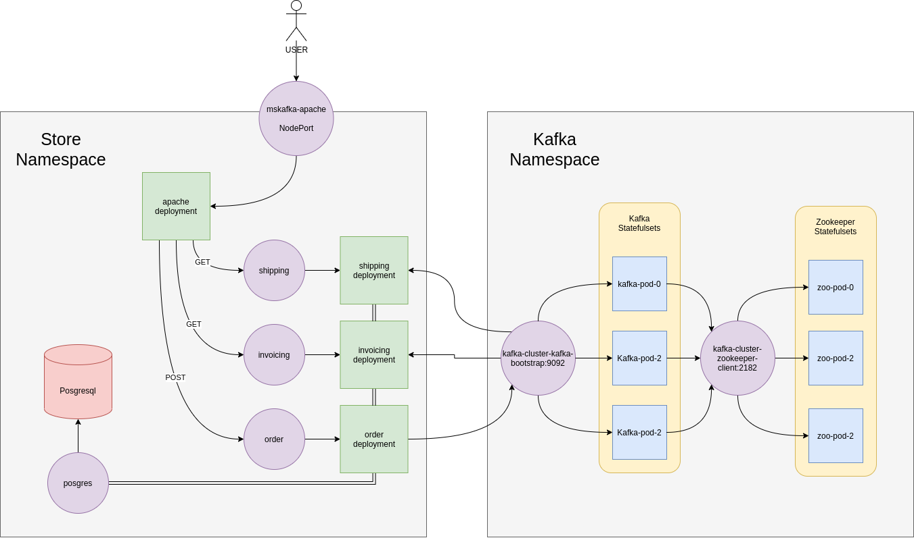

Run In Kubernetes
-----------------

See [How to build image](HOW-TO-RUN.md) if you want make from scratch, or use pre built images in the following registry.

[https://hub.docker.com/u/prasta](https://hub.docker.com/u/prasta)
- mskafka_apache: `docker pull prasta/mskafka_apache`
- mskafka_order: `docker pull prasta/mskafka_order`
- mskafka_invoicing: `docker pull prasta/mskafka_invoicing`
- mskafka_shipping: `docker pull prasta/mskafka_shipping`
- mskafka_posgres: `docker pull prasta/mskafka_postgres`

### Kafka Installation on kubernetes

I highly recommend [strimzi.io](https://strimzi.io/) operator for the kafka installation method on kubernetes cluster.

Follow [this procedure](Strimzi-Installation.md) for details of using strimzi.io 

### Microservice Installation



Microservice application for this example will running on `store` namespace

1. Clone this repository
    ```
    git clone https://github.com/prastamaha/microservice-kafka.git
    cd microservice-kafka/kubernetes/manifest
    ```

2. Apply the manifest file

    **Namespace**
    ```
    kubectl create -f namespace
    ```

    **Secret**
    ```
    kubectl create -f secret
    ```

    **ConfigMap**
    ```
    kubectl create -f configmap
    ```

    **Posgres**
    ```
    kubectl create -f posgres
    ```

    **Apache**
    ```
    kubectl create -f apache
    ```

    **Order**
    ```
    kubectl create -f order
    ```

    **Shipping**
    ```
    kubectl create -f shipping
    ```

    **Invoicing**
    ```
    kubectl create -f invoicing
    ```

3. Access Frontend apache

    http://<Your_Node_Ip_Address>:30800

