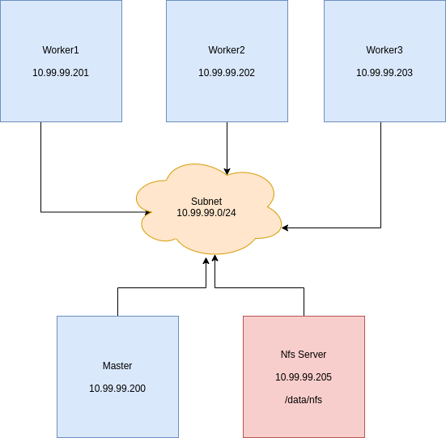

Install Kafka on Kubernetes using Strimzi.io
--------------------------------------------

### Kubernetes Architecture



Tested on kubernetes **1.20.2** release

### Instalasi Strimzi

at the time this was written, the latest version of Strimzi is **0.22.1** and Kafka **2.7**

Official guide: [here](https://strimzi.io/docs/operators/latest/quickstart.html)

**Execute only at the master node**

1. Download strimzi

    ```bash
    mkdir strimzi && cd strimzi
    wget https://github.com/strimzi/strimzi-kafka-operator/releases/download/0.22.1/strimzi-0.22.1.tar.gz
    tar zxvf strimzi-0.22.1.tar.gz
    cd strimzi-0.22.1
    ```

2. Create `kafka-operator` namespace for deployment of strimzi-kafka-operator

    ```bash
    kubectl create ns kafka-operator
    ```

3. Change strimzi rolebinding manifest to kafka-operator namespace

    ```bash
    sed -i 's/namespace: .*/namespace: kafka-operator/' install/cluster-operator/*RoleBinding*.yaml
    ```

4. Create `kafka` namespace for kafka and zookeeper statefulsets by strimzi-kafka-operator

    ```bash
    kubectl create ns kafka
    ```

5. Change the manifest strimzi-kafka-operator env `STRIMZI_NAMESPACE` using value `kafka`

    ```bash
    nano install/cluster-operator/060-Deployment-strimzi-cluster-operator.yaml

    # ...
    env:
    - name: STRIMZI_NAMESPACE
      value: kafka
    # ...
    ```

6. Deploy strimzi Custom Resource Definition

    ```bash
    kubectl create -f install/cluster-operator/ -n kafka-operator
    ```

7. Give permission for the strimzi-kafka-operator to the `kafka` namespace

    ```bash
    kubectl create -f install/cluster-operator/020-RoleBinding-strimzi-cluster-operator.yaml -n kafka
    kubectl create -f install/cluster-operator/032-RoleBinding-strimzi-cluster-operator-topic-operator-delegation.yaml -n kafka
    kubectl create -f install/cluster-operator/031-RoleBinding-strimzi-cluster-operator-entity-operator-delegation.yaml -n kafka
    ```

8. Label nodes for podantiaffinity so that no kafka pod are placed on the same node

    ```bash
    kubectl label nodes pr-worker1 app=kafka
    kubectl label nodes pr-worker2 app=kafka
    kubectl label nodes pr-worker3 app=kafka
    ```

9. Create Kafka Cluster

    ```bash
    nano kafka-cluster.yaml
    ```

    ```yaml
    apiVersion: kafka.strimzi.io/v1beta2
    kind: Kafka
    metadata:
      name: kafka-cluster
      namespace: kafka
    spec:
      kafka:
        replicas: 3
        affinity:
          podAntiAffinity:
            requiredDuringSchedulingIgnoredDuringExecution:
            - labelSelector:
                matchExpressions:
                - key: app
                  operator: In
                  values:
                  - kafka
              topologyKey: "kubernetes.io/hostname"
        listeners:
          - name: plain
            port: 9092
            type: internal
            tls: false
          - name: tls
            port: 9093
            type: internal
            tls: true
            authentication:
              type: tls
        storage:
          type: persistent-claim
          size: 20Gi
          deleteClaim: false
          class: managed-nfs-storage
        config:
          offsets.topic.replication.factor: 3
          transaction.state.log.replication.factor: 3
          transaction.state.log.min.isr: 2
          log.message.format.version: "2.7"
          inter.broker.protocol.version: "2.7"
      zookeeper:
        replicas: 3
        affinity:
          podAntiAffinity:
            requiredDuringSchedulingIgnoredDuringExecution:
            - labelSelector:
                matchExpressions:
                - key: app
                  operator: In
                  values: 
                  - kafka
              topologyKey: "kubernetes.io/hostname"
        storage:
          type: persistent-claim
          size: 20Gi
          deleteClaim: false
          class: managed-nfs-storage
      entityOperator:
        topicOperator: {}
        userOperator: {}
    ```

    ```bash
    kubectl create -f kafka-cluster.yaml
    ```

10. Wait until the Kafka cluster is running

    ```yaml
    kubectl wait kafka/kafka-cluster --for=condition=Ready --timeout=300s -n kafka
    ```

11. Verify

    ```yaml
    kubectl get all -n kafka
    ```

Until here, kafka cluster has been running on the `kafka` namespace